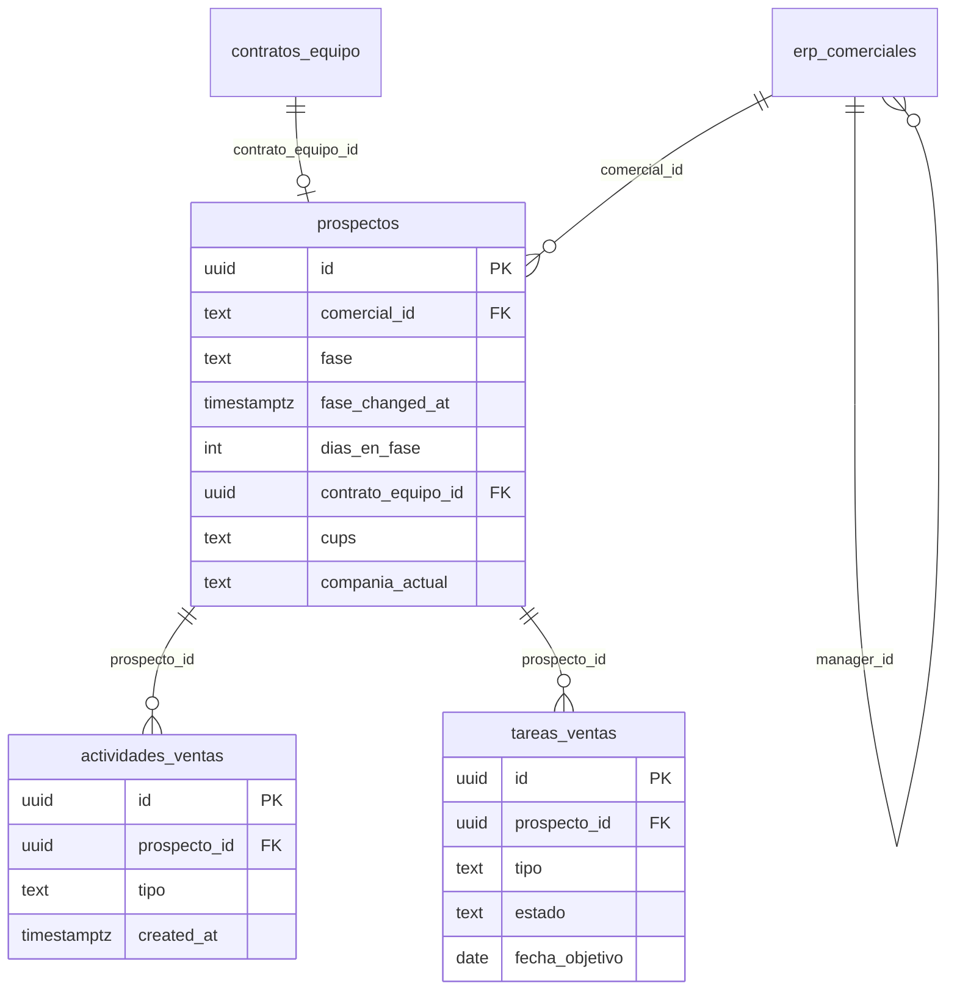
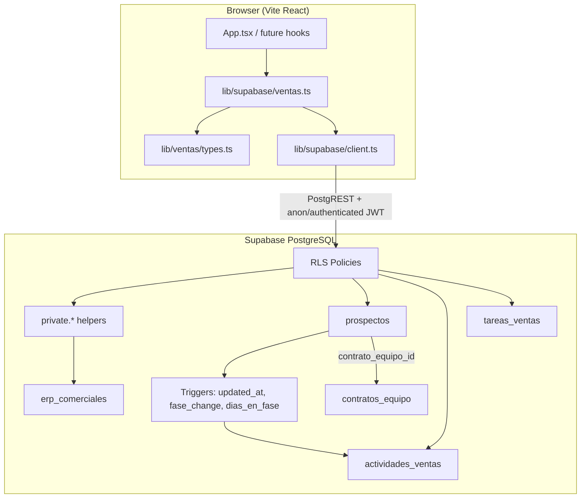

# Phase ENERSAVE-01: Schema & Supabase Ventas - Research

**Researched:** 2026-06-17
**Domain:** PostgreSQL schema, Supabase migrations/RLS, TypeScript data layer
**Confidence:** MEDIUM (codebase patterns verified; remote ventas schema unverified — MCP unauthorized)

## Summary

Phase 1 establishes the **data foundation** for the sales module: three ventas tables (`prospectos`, `actividades_ventas`, `tareas_ventas`), DB triggers for audit timeline and SLA fields, RLS aligned to commercial hierarchy, and a TypeScript client layer mirroring `src/lib/supabase/contracts.ts`.

The repo is **brownfield**: only `contratos_equipo` exists locally in `supabase/migrations/`. User reports ventas migrations were applied remotely but are **not committed** — Phase 1 must **pull schema from remote** (Supabase Dashboard SQL export, `supabase db pull`, or MCP once authorized) and commit canonical migrations. Without that step, local types and RLS will drift from production.

Critical constraint: **simulated auth** in `App.tsx` uses text profile IDs (`usr-1`, `usr-2`) while `supabase-setup.sql` assumes UUID `auth.users` + `profiles`. Ventas tables must follow **`contratos_equipo` convention** (`comercial_id text`) and RLS must bridge to hierarchy via a **mapping/seed table** until real Supabase Auth ships.

**Primary recommendation:** Reverse-engineer remote DDL into ordered migrations, add `erp_comerciales` (text IDs + `manager_id`) for RLS hierarchy, implement SECURITY DEFINER helpers in a non-exposed schema, then build `src/lib/ventas/types.ts` + `src/lib/supabase/ventas.ts` with snake_case row mappers and discriminated-union results matching `contracts.ts`.

## Architectural Responsibility Map

| Capability | Primary Tier | Secondary Tier | Rationale |
|------------|-------------|----------------|-----------|
| Table DDL, enums, FKs, triggers | Database / Storage | — | Business invariants (immutable timeline, fase audit) belong in Postgres |
| RLS policies & hierarchy helpers | Database / Storage | — | Authorization must not rely on client-side filtering alone |
| Row ↔ domain mappers, CRUD calls | Browser / Client (`src/lib/supabase/`) | — | Matches existing `contracts.ts`; hooks consume this in Phase 3 |
| Domain types & enums (fase, tarea tipo) | Browser / Client (`src/lib/ventas/types.ts`) | Database CHECK/ENUM | TS types are source for UI; DB enforces integrity |
| Pipeline transition rules | Browser / Client (Phase 2) | Database trigger for `cambio_fase` activity only | PIPE-02 is client-side; DB only auto-logs fase changes |
| Auth / role simulation | Browser / Client (`App.tsx`) today | Database (future JWT claims) | RLS written for future auth; interim verification via SQL tests |

<phase_requirements>
## Phase Requirements

| ID | Description | Research Support |
|----|-------------|------------------|
| DATA-01 | Migraciones locales alineadas con tablas ventas + triggers documentados | Schema Design + Recommended Migration Order; reverse-engineer remote DDL first |
| DATA-02 | RLS por comercial y jerarquía | RLS Strategy with `erp_comerciales` + SECURITY DEFINER helpers |
| DATA-03 | Tipos TS en `src/lib/ventas/types.ts` sin `any` | TypeScript Mapping; optional generated `database.types.ts` |
| DATA-04 | Cliente Supabase ventas con mappers row ↔ domain | Client API Patterns mirroring `contracts.ts` |
</phase_requirements>

<user_constraints>
## User Constraints (from project context — no CONTEXT.md)

### Locked Decisions (PROJECT.md / STATE.md)

- Ventas module lives in `src/pages/ventas/` + `src/lib/ventas/` (Phase 1 delivers `types.ts` + supabase layer only)
- DB triggers record fase changes in `actividades_ventas`; quick-win task generation stays client-side (Phase 3)
- Conversion at fase `enviado` reuses `NuevoContratoWizard` / existing `contratos_equipo` insert (Phase 7)
- Pipeline: 10 fases — `prospecto_nuevo` → `contactado` → `cualificado` → `propuesta_enviada` → `negociacion` → `documentacion` → `enviado` → `cliente_activo` → `recontactar` → `descartado`
- FK `prospectos.contrato_equipo_id` → `contratos_equipo.id` on conversion
- Profiles use **text** `comercial_id` (`usr-1` style); Supabase Auth not wired yet
- Remote migrations for ventas exist but **not in repo** — align in Phase 1

### Claude's Discretion

- Exact column set for energy/propuesta fields (infer from requirements + `Contract` overlap)
- Whether to use Postgres ENUM vs TEXT + CHECK for fase/tipo columns
- RLS interim testing strategy until auth milestone
- Optional `supabase gen types` vs hand-written row interfaces

### Deferred Ideas (OUT OF SCOPE)

- Real Supabase Auth login replacement
- Quick-wins task engine (Phase 3)
- Pipeline UI, hooks Realtime (Phases 3–4)
- Liquidaciones/incidencias persistence
</user_constraints>

## Schema Design

> **Confidence note:** Column-level detail for remote tables is `[ASSUMED]` until DDL is exported from Supabase. Structure below matches REQUIREMENTS.md, PROJECT.md, and `contratos_equipo` conventions.

### Entity relationship



### Table: `prospectos`

Central pipeline entity. Follow `contratos_equipo` naming (`snake_case`, `comercial_id text`).

| Column | Type | Notes |
|--------|------|-------|
| `id` | `uuid` PK `default gen_random_uuid()` | |
| `created_at` | `timestamptz not null default now()` | |
| `updated_at` | `timestamptz not null default now()` | `handle_updated_at` trigger |
| `comercial_id` | `text not null` | Matches `usr-*` IDs in App; **indexed** |
| `comercial_name` | `text not null` | Denormalized for cards/reporting |
| `nombre` | `text not null` | Contact / company name |
| `telefono` | `text` | |
| `email` | `text` | |
| `nif` | `text` | |
| `fase` | `text not null default 'prospecto_nuevo'` | CHECK or enum — 10 values |
| `fase_changed_at` | `timestamptz not null default now()` | Reset on fase change |
| `dias_en_fase` | `integer not null default 0` | Maintained by `handle_dias_en_fase` |
| `motivo_descarte` | `text` | Required when `fase = 'descartado'` (app + optional CHECK) |
| `contrato_equipo_id` | `uuid references contratos_equipo(id) on delete set null` | Set in Phase 7 integration |
| `cups` | `text` | Energy identifier |
| `tipo_suministro` | `text check (tipo_suministro in ('luz','gas'))` | Align with contracts |
| `consumo_anual_kwh` | `numeric` | |
| `compania_actual` | `text` | Current retailer |
| `vencimiento_permanencia` | `date` | |
| `tarifa_actual` | `text` | Optional |
| `propuesta_compania` | `text` | Proposal block |
| `propuesta_tarifa` | `text` | |
| `propuesta_notas` | `text` | |
| `direccion` | `text` | |
| `codigo_postal` | `text` | |
| `poblacion` | `text` | |
| `provincia` | `text` | |
| `metadata` | `jsonb default '{}'` | Extensibility |

**Indexes:** `(comercial_id)`, `(fase)`, `(comercial_id, fase)`, `(contrato_equipo_id)` where not null.

### Table: `actividades_ventas`

**Immutable timeline** — insert-only from app; fase changes also inserted by trigger.

| Column | Type | Notes |
|--------|------|-------|
| `id` | `uuid` PK | |
| `prospecto_id` | `uuid not null references prospectos(id) on delete cascade` | |
| `comercial_id` | `text not null` | Actor at time of event |
| `comercial_name` | `text` | |
| `tipo` | `text not null` | e.g. `nota`, `llamada`, `email`, `reunion`, `cambio_fase`, `contrato_creado` |
| `titulo` | `text` | Short label for timeline |
| `descripcion` | `text` | Body |
| `metadata` | `jsonb default '{}'` | For `cambio_fase`: `{ fase_anterior, fase_nueva }` |
| `created_at` | `timestamptz not null default now()` | **No `updated_at`** — immutable |

**RLS implication:** SELECT + INSERT only; no UPDATE/DELETE policies for `authenticated` (except superadmin maintenance if needed).

### Table: `tareas_ventas`

Mutable task queue for Mi Día (Phase 5).

| Column | Type | Notes |
|--------|------|-------|
| `id` | `uuid` PK | |
| `created_at` / `updated_at` | `timestamptz` | `handle_updated_at` on table |
| `prospecto_id` | `uuid not null references prospectos(id) on delete cascade` | |
| `comercial_id` | `text not null` | Assignee |
| `tipo` | `text not null` | TASK-03: `primer_contacto`, `llamada_seguimiento`, `enviar_propuesta`, `recoger_documentacion`, `verificar_alta`, `recontacto_programado`, `encuesta_satisfaccion` |
| `estado` | `text not null default 'pendiente'` | `pendiente`, `completada`, `descartada` |
| `prioridad` | `text not null default 'media'` | `alta`, `media`, `baja` |
| `fecha_objetivo` | `date` | Mi Día ordering |
| `titulo` | `text` | |
| `notas` | `text` | |
| `completada_at` | `timestamptz` | Set when `estado = 'completada'` |
| `origen_fase` | `text` | Fase that spawned task (dedup key for Phase 3) |
| `metadata` | `jsonb default '{}'` | |

**Indexes:** `(comercial_id, estado)`, `(comercial_id, fecha_objetivo)`, `(prospecto_id, tipo, origen_fase)` for deduplication.

### Supporting table: `erp_comerciales` (recommended for RLS)

Bridge simulated App profiles to DB hierarchy until Auth uses UUID profiles.

| Column | Type | Notes |
|--------|------|-------|
| `id` | `text` PK | `usr-1`, `usr-2`, … |
| `full_name` | `text not null` | |
| `role` | `text not null` | `superadmin`, `jefe_comercial`, `comercial` |
| `manager_id` | `text references erp_comerciales(id)` | |
| `auth_user_id` | `uuid` | Nullable; populated when Auth ships |

Seed from App.tsx profile seeds in migration or seed SQL.

### Triggers (documented in migration comments)

| Trigger | Function | Behavior |
|---------|----------|----------|
| `trigger_prospectos_updated_at` | `handle_updated_at()` | Reuse from `supabase-setup.sql` if present |
| `trigger_prospectos_fase_change` | `handle_fase_change()` | On `fase` change: set `fase_changed_at`, insert `actividades_ventas` row `tipo='cambio_fase'` |
| `trigger_prospectos_dias_en_fase` | `handle_dias_en_fase()` | On insert/update: set `dias_en_fase = floor(extract(epoch from (now() - fase_changed_at))/86400)` |

Example `handle_fase_change` pattern `[ASSUMED]`:

```sql
create or replace function public.handle_fase_change()
returns trigger
language plpgsql
security definer
set search_path = public
as $$
begin
  if tg_op = 'UPDATE' and new.fase is distinct from old.fase then
    new.fase_changed_at := timezone('utc', now());
    new.dias_en_fase := 0;
    insert into public.actividades_ventas (
      prospecto_id, comercial_id, comercial_name, tipo, titulo, descripcion, metadata
    ) values (
      new.id,
      coalesce(new.comercial_id, old.comercial_id),
      new.comercial_name,
      'cambio_fase',
      'Cambio de fase',
      format('%s → %s', old.fase, new.fase),
      jsonb_build_object('fase_anterior', old.fase, 'fase_nueva', new.fase)
    );
  end if;
  return new;
end;
$$;
```

**Planner rule:** Do **not** duplicate fase-change activity inserts in client code — triggers own `cambio_fase` rows.

### ENUM vs TEXT + CHECK

| Approach | Pros | Cons |
|----------|------|------|
| **TEXT + CHECK** (match `contratos_equipo.tipo`) | Easy migration additions; matches existing repo style | Typos caught only at insert |
| **Postgres ENUM** | DB-enforced; good for generated types | Requires migration to add values |

**Recommendation:** Use **TEXT + CHECK** for `fase` and task `tipo` to match `contratos_equipo` and simplify remote alignment `[ASSUMED]` — confirm against exported remote DDL.

## RLS Strategy

### Problem: simulated auth vs RLS

- Client uses **anon key** with no real JWT user `[VERIFIED: src/lib/supabase/client.ts]`.
- Rows use **`comercial_id text`**, not `auth.uid()` `[VERIFIED: contratos_equipo migration]`.
- `supabase-setup.sql` RLS assumes UUID `profiles.id = auth.uid()` — **not applicable** to ventas without adaptation `[VERIFIED: supabase-setup.sql]`.

### Target model (production-ready)

1. **`erp_comerciales`** holds hierarchy (`id`, `manager_id`, `role`, optional `auth_user_id`).
2. **Private schema helpers** (not in API exposed schemas) `[CITED: https://supabase.com/docs/guides/database/postgres/row-level-security]`:

```sql
-- Schema private NOT exposed in Supabase API settings
create schema if not exists private;

create or replace function private.current_comercial_id()
returns text
language sql
stable
security definer
set search_path = public
as $$
  select coalesce(
    auth.jwt() -> 'app_metadata' ->> 'comercial_id',
    (select ec.id from public.erp_comerciales ec
     where ec.auth_user_id = auth.uid())
  );
$$;

create or replace function private.current_role()
returns text
language sql
stable
security definer
set search_path = public
as $$
  select coalesce(
    auth.jwt() -> 'app_metadata' ->> 'role',
    (select ec.role from public.erp_comerciales ec
     where ec.auth_user_id = auth.uid())
  );
$$;

create or replace function private.accessible_comercial_ids()
returns setof text
language sql
stable
security definer
set search_path = public
as $$
  select id from public.erp_comerciales
  where private.current_role() = 'superadmin'
  union
  select private.current_comercial_id()
  where private.current_comercial_id() is not null
  union
  select id from public.erp_comerciales
  where manager_id = private.current_comercial_id()
    and private.current_role() = 'jefe_comercial';
$$;
```

3. **Policies on `prospectos`** (one policy per operation per role pattern) `[CITED: Supabase RLS docs]`:

| Operation | Role | USING / WITH CHECK |
|-----------|------|-------------------|
| SELECT | authenticated | `comercial_id in (select private.accessible_comercial_ids())` |
| INSERT | authenticated | `comercial_id = (select private.current_comercial_id()) OR (select private.current_role()) in ('jefe_comercial','superadmin')` |
| UPDATE | authenticated | same USING + WITH CHECK preserves `comercial_id` unless superadmin |
| DELETE | authenticated | superadmin only (or soft-delete via fase — prefer no hard delete) |

4. **Child tables** inherit scope via prospecto join or denormalized `comercial_id`:

```sql
-- actividades_ventas SELECT
using (
  prospecto_id in (
    select id from public.prospectos
    where comercial_id in (select private.accessible_comercial_ids())
  )
);
```

5. **Immutability:** No UPDATE/DELETE policies on `actividades_ventas` for `comercial`/`jefe_comercial`.

6. **Performance:** Index `comercial_id`; wrap helpers as `(select private.current_comercial_id())` in policies `[CITED: Supabase RLS performance section]`.

### Interim verification (pre-Auth milestone)

Until JWT carries `app_metadata.comercial_id`:

| Method | Purpose |
|--------|---------|
| Export remote policies after user applies migrations | Confirm alignment |
| SQL tests in migration folder (`supabase/tests/*.sql`) with `set local role authenticated` + mock JWT | Prove policy logic |
| Dashboard "Test policy" with sample JWT | Manual DATA-02 acceptance |
| Document that **anon key without JWT will return zero rows** once RLS enabled — expected |

**Do not** ship `USING (true)` on ventas tables in production.

### `contratos_equipo` RLS gap

Existing migration has **no RLS** `[VERIFIED: 20260601000000_create_contratos_equipo.sql]`. Phase 1 should add matching policies or document as follow-up — prospecto FK reads may need consistent comercial scope in Phase 7.

## TypeScript Mapping

### File layout

```
src/lib/ventas/
  types.ts          # Domain types (camelCase) — DATA-03
src/lib/supabase/
  ventas.ts         # Row types, mappers, CRUD — DATA-04
  database.types.ts # Optional generated — not required Phase 1
```

### Domain types (`src/lib/ventas/types.ts`)

Mirror patterns in `src/lib/incidencias.ts` and `src/types/contract.ts`: string union enums, exported interfaces, no `any`.

```typescript
export type ProspectoFase =
  | "prospecto_nuevo"
  | "contactado"
  | "cualificado"
  | "propuesta_enviada"
  | "negociacion"
  | "documentacion"
  | "enviado"
  | "cliente_activo"
  | "recontactar"
  | "descartado"

export type ActividadTipo =
  | "nota"
  | "llamada"
  | "email"
  | "reunion"
  | "cambio_fase"
  | "contrato_creado"

export type TareaTipo =
  | "primer_contacto"
  | "llamada_seguimiento"
  | "enviar_propuesta"
  | "recoger_documentacion"
  | "verificar_alta"
  | "recontacto_programado"
  | "encuesta_satisfaccion"

export type TareaEstado = "pendiente" | "completada" | "descartada"
export type TareaPrioridad = "alta" | "media" | "baja"

export interface Prospecto {
  id: string
  comercialId: string
  comercialName: string
  nombre: string
  telefono?: string
  email?: string
  nif?: string
  fase: ProspectoFase
  faseChangedAt: string
  diasEnFase: number
  motivoDescarte?: string
  contratoEquipoId?: string
  cups?: string
  tipoSuministro?: "luz" | "gas"
  consumoAnualKwh?: number
  companiaActual?: string
  vencimientoPermanencia?: string
  propuestaCompania?: string
  propuestaTarifa?: string
  propuestaNotas?: string
  direccion?: string
  codigoPostal?: string
  poblacion?: string
  provincia?: string
  metadata?: Record<string, unknown>
  createdAt: string
  updatedAt: string
}

export interface ActividadVenta {
  id: string
  prospectoId: string
  comercialId: string
  comercialName?: string
  tipo: ActividadTipo
  titulo?: string
  descripcion?: string
  metadata?: Record<string, unknown>
  createdAt: string
}

export interface TareaVenta {
  id: string
  prospectoId: string
  comercialId: string
  tipo: TareaTipo
  estado: TareaEstado
  prioridad: TareaPrioridad
  fechaObjetivo?: string
  titulo?: string
  notas?: string
  completadaAt?: string
  origenFase?: ProspectoFase
  metadata?: Record<string, unknown>
  createdAt: string
  updatedAt: string
}
```

### Row types & mappers

Follow `TeamContractInsert` + `buildTeamContractRow` in `contracts.ts` `[VERIFIED: src/lib/supabase/contracts.ts]`:

- `ProspectoRow`, `ProspectoInsert`, `ProspectoUpdate`
- `mapProspectoRow(row: ProspectoRow): Prospecto`
- `buildProspectoInsert(input: CreateProspectoInput): ProspectoInsert`
- Same for actividades/tareas

Naming: **DB snake_case**, **domain camelCase**. Dates as ISO strings in domain layer.

### Optional generated types

`npx supabase gen types typescript --project-id "$REF"` `[CITED: https://supabase.com/docs/guides/api/rest/generating-types]` produces `Database` for `createClient<Database>()`. Project does not use this yet. **Recommendation:** Hand-write row interfaces in Phase 1 for control; add codegen script in Wave 0 or Phase 2 when CLI available.

## Client API Patterns

Mirror `saveTeamContractToSupabase` contract:

### Result discriminated unions

```typescript
export type VentasResult<T> =
  | { ok: true; data: T }
  | { ok: false; reason: "not_configured" | "table_missing" | "rls_denied" | "error"; message: string }
```

Add `"rls_denied"` for PostgREST `42501` / policy failures.

### Functions to implement in `src/lib/supabase/ventas.ts`

| Function | Purpose |
|----------|---------|
| `listProspectos(filters?)` | SELECT with optional `.eq('comercial_id', …)` for perf |
| `getProspecto(id)` | Single row |
| `createProspecto(input)` | INSERT default fase `prospecto_nuevo` |
| `updateProspecto(id, patch)` | PATCH; fase change via dedicated helper |
| `updateProspectoFase(id, fase, motivoDescarte?)` | UPDATE fase only; trigger handles activity |
| `listActividades(prospectoId)` | ORDER BY created_at DESC |
| `createActividad(input)` | INSERT manual activities (not `cambio_fase`) |
| `listTareas(comercialId, filters?)` | Queue for Mi Día |
| `createTarea(input)` | INSERT |
| `updateTarea(id, patch)` | Complete/dismiss |

### Error handling pattern (from contracts.ts)

```typescript
if (error) {
  const isMissingTable =
    error.code === "42P01" ||
    error.message.toLowerCase().includes("does not exist")
  const isRls =
    error.code === "42501" ||
    error.message.toLowerCase().includes("row-level security")
  return {
    ok: false,
    reason: isMissingTable ? "table_missing" : isRls ? "rls_denied" : "error",
    message: error.message,
  }
}
```

### Client filters + RLS

Even with RLS, add `.eq('comercial_id', comercialId)` on list queries — Supabase performance recommendation `[CITED: Supabase RLS docs]`.

## Standard Stack

### Core

| Library | Version | Purpose | Why Standard |
|---------|---------|---------|--------------|
| `@supabase/supabase-js` | ^2.106.1 (repo) / 2.108.2 (registry) | DB client | Already used in project |
| PostgreSQL (Supabase) | hosted | Schema, RLS, triggers | Project backend |
| TypeScript | ~5.8.2 | Types | Project standard |
| `zod` | ^4.4.3 | Optional input validation at mapper boundary | Already in dependencies |

### Supporting

| Library | Version | Purpose | When to Use |
|---------|---------|---------|-------------|
| Supabase CLI | latest | `db pull`, `gen types`, migration apply | Dev machine setup (not installed yet) |
| `vitest` | latest | Unit tests for mappers | Wave 0 if Nyquist enabled |

**No new runtime packages required for Phase 1** if using hand-written types.

### Alternatives Considered

| Instead of | Could Use | Tradeoff |
|------------|-----------|----------|
| Hand-written mappers | `supabase gen types` only | Less boilerplate but no camelCase domain layer |
| TEXT comercial_id RLS | UUID auth.uid() only | Cleaner auth but breaks brownfield IDs |
| Client-side scope filter | RLS only | Insecure — never for production |

## Package Legitimacy Audit

> Phase 1 adds no required new packages. Optional Wave 0: vitest.

| Package | Registry | Verdict | Disposition |
|---------|----------|---------|-------------|
| `@supabase/supabase-js` | npm | OK (already installed; seam flagged SUS "too-new" on latest — pin to repo version) | Approved |
| `zod` | npm | OK | Approved |
| `vitest` | npm | SUS if added (seam "too-new") | Flag — checkpoint before install |

**Packages removed due to SLOP verdict:** none
**Packages flagged as suspicious [SUS]:** vitest (only if added in Wave 0)

## Architecture Patterns

### System Architecture Diagram



### Recommended Project Structure

```
supabase/migrations/
  20260601000000_create_contratos_equipo.sql          # exists
  20260617000001_create_erp_comerciales.sql           # new
  20260617000002_create_ventas_core.sql               # prospectos + children
  20260617000003_create_ventas_triggers.sql           # shared functions + triggers
  20260617000004_create_ventas_rls.sql                # policies
src/lib/ventas/types.ts
src/lib/supabase/ventas.ts
```

### Pattern 1: Row builder + result union (contracts.ts)

**What:** Separate DB insert shape from domain model; return `{ ok, reason }` not thrown errors for expected failures.
**When to use:** All Supabase write/read functions.
**Example:** See `buildTeamContractRow` / `saveTeamContractToSupabase` in `src/lib/supabase/contracts.ts`.

### Anti-Patterns to Avoid

- **Duplicating `cambio_fase` inserts in client** — trigger owns timeline entries
- **Using `any` for metadata** — use `Record<string, unknown>` or typed metadata interfaces
- **RLS with `auth.uid() = comercial_id`** when IDs are text `usr-*`
- **Exposing `private` schema** in Supabase API settings
- **Skipping SELECT policy on tables with UPDATE** — updates silently fail `[CITED: Supabase RLS docs]`

## Don't Hand-Roll

| Problem | Don't Build | Use Instead | Why |
|---------|-------------|-------------|-----|
| `updated_at` maintenance | Per-table ad hoc triggers | Shared `handle_updated_at()` | Already in `supabase-setup.sql` |
| Fase change audit row | Client-only logging | `handle_fase_change()` trigger | Single source of truth, Realtime friendly |
| SQL string concatenation in app | Dynamic SQL | Supabase query builder + parameterized RPC if needed | Injection risk |
| Auth hierarchy in React only | Client filter | RLS + `erp_comerciales` | Anon key bypasses UI filters |
| UUID generation | Custom IDs | `gen_random_uuid()` | Postgres native |

## Recommended Migration Order

1. **`20260617000001_create_erp_comerciales.sql`**
   - Table + seed rows matching App.tsx profiles (`usr-1`…)
   - Enables RLS helpers

2. **`20260617000002_create_ventas_enums_or_checks.sql`** (optional split)
   - Shared `handle_updated_at()` if not already on remote
   - `prospectos` table + indexes
   - `actividades_ventas` table + indexes
   - `tareas_ventas` table + indexes
   - FK to `contratos_equipo`

3. **`20260617000003_create_ventas_triggers.sql`**
   - `handle_fase_change()`, `handle_dias_en_fase()`
   - Triggers on `prospectos`
   - `updated_at` triggers on mutable tables
   - COMMENT ON documenting trigger behavior (DATA-01)

4. **`20260617000004_create_ventas_rls.sql`**
   - `private` schema + helper functions
   - ENABLE RLS on all ventas tables
   - Policies per operation
   - GRANTs for `authenticated` / `anon`

5. **Verification migration or seed** (optional)
   - Sample prospecto rows for dev (service role only)

**First action before writing migrations:** Pull authoritative DDL from remote Supabase (Dashboard → Schema SQL, or `supabase db pull` after `supabase link`). Diff against recommendations above; **remote wins** on column names.

## Common Pitfalls

### Pitfall 1: Schema drift (remote vs repo)

**What goes wrong:** Types and mappers built against guessed schema fail at runtime.
**Why:** Migrations applied remotely but not committed `[VERIFIED: STATE.md]`.
**How to avoid:** Export remote DDL first; name migration files with timestamps after existing.
**Warning signs:** `column does not exist` from PostgREST.

### Pitfall 2: RLS blocks all dev traffic

**What goes wrong:** Every query returns `[]` or 403 after enabling RLS.
**Why:** Anon client without JWT claims; `current_comercial_id()` returns null.
**How to avoid:** Document test JWT setup; use SQL policy tests; plan Auth integration.
**Warning signs:** Empty pipeline with no errors in UI.

### Pitfall 3: Immutable timeline violated

**What goes wrong:** Activities edited/deleted; audit trail lost.
**Why:** UPDATE policies on `actividades_ventas`.
**How to avoid:** INSERT + SELECT policies only for standard roles.
**Warning signs:** `updated_at` column on actividades table.

### Pitfall 4: Missing SELECT policy breaks UPDATE

**What goes wrong:** Fase updates fail silently or with obscure errors.
**Why:** Postgres requires SELECT visibility for updated rows `[CITED: Supabase RLS docs]`.
**How to avoid:** Pair SELECT + UPDATE policies with same USING clause.
**Warning signs:** `UPDATE` returns 0 rows without error.

### Pitfall 5: `dias_en_fase` stale

**What goes wrong:** SLA badges wrong in UI (Phase 2+).
**Why:** Trigger only runs on row change, not calendar midnight.
**How to avoid:** Compute on read in Phase 2 **or** add nightly pg_cron job (deferred); document as known limitation for v1.0.
**Warning signs:** `dias_en_fase` unchanged after days without edits.

## Risks / Pitfalls (consolidated)

| Risk | Severity | Mitigation |
|------|----------|------------|
| Remote schema unknown | HIGH | User exports DDL; blocker for DATA-01 |
| Supabase MCP/CLI unavailable | MEDIUM | Manual Dashboard export; install CLI |
| Auth not wired — RLS untestable from app | HIGH | SQL policy tests + JWT test harness |
| `contratos_equipo` without RLS | MEDIUM | Align policies in Phase 1 or 7 |
| No test framework | MEDIUM | Wave 0 vitest for mappers; SQL for RLS |
| Dual profile models (UUID vs text) | HIGH | `erp_comerciales` bridge table |

## Code Examples

### Mapper (contracts.ts pattern)

```typescript
// Source: src/lib/supabase/contracts.ts (project convention)
export function mapProspectoRow(row: ProspectoRow): Prospecto {
  return {
    id: String(row.id),
    comercialId: row.comercial_id,
    comercialName: row.comercial_name,
    nombre: row.nombre,
    fase: row.fase as ProspectoFase,
    faseChangedAt: row.fase_changed_at,
    diasEnFase: row.dias_en_fase,
    contratoEquipoId: row.contrato_equipo_id ?? undefined,
    createdAt: row.created_at,
    updatedAt: row.updated_at,
    // ...optional fields with ?? undefined
  }
}
```

### List with client-side filter (performance)

```typescript
// Source: [CITED: https://supabase.com/docs/guides/database/postgres/row-level-security]
const { data, error } = await supabase
  .from("prospectos")
  .select("*")
  .eq("comercial_id", comercialId)
  .order("updated_at", { ascending: false })
```

### Typed client (future enhancement)

```typescript
// Source: [CITED: https://supabase.com/docs/reference/javascript/typescript-support]
import { createClient } from "@supabase/supabase-js"
import type { Database } from "./database.types"

export function getSupabaseClient(): SupabaseClient<Database> | null {
  // ...
}
```

## Validation Architecture

> Nyquist enabled (no `workflow.nyquist_validation: false` in config).

### Test Framework

| Property | Value |
|----------|-------|
| Framework | **None** — `package.json` has only `tsc --noEmit` |
| Config file | none |
| Quick run command | `npm run lint` |
| Full suite command | N/A until Wave 0 |

### Phase Requirements → Test Map

| Req ID | Behavior | Test Type | Automated Command | File Exists? |
|--------|----------|-----------|-------------------|-------------|
| DATA-01 | Migrations apply cleanly | integration | `supabase db reset` (after CLI install) | ❌ Wave 0 |
| DATA-01 | Triggers fire on fase change | SQL/integration | psql test script | ❌ Wave 0 |
| DATA-02 | Comercial cannot read other's prospectos | SQL RLS | `supabase test db` or pgTAP | ❌ Wave 0 |
| DATA-03 | Types compile without `any` | static | `npm run lint` | ❌ types file |
| DATA-04 | Mappers round-trip required fields | unit | `npx vitest run src/lib/ventas` | ❌ Wave 0 |

### Sampling Rate

- **Per task commit:** `npm run lint`
- **Per wave merge:** vitest (once added) + manual Supabase smoke via ventas.ts
- **Phase gate:** Migration apply on clean DB + RLS SQL tests green

### Wave 0 Gaps

- [ ] Install/configure **vitest** + `vitest.config.ts`
- [ ] `src/lib/ventas/types.test.ts` — mapper round-trip fixtures
- [ ] `supabase/tests/ventas_rls.test.sql` — policy tests with mock JWT claims
- [ ] Install **Supabase CLI** + `config.toml` for local `db reset`
- [ ] Script `npm run test` in package.json

## Security Domain

### Applicable ASVS Categories

| ASVS Category | Applies | Standard Control |
|---------------|---------|------------------|
| V2 Authentication | Partial (future) | JWT `app_metadata` for comercial_id — not Phase 1 |
| V3 Session Management | No | Simulated login |
| V4 Access Control | **Yes** | RLS + hierarchy helpers |
| V5 Input Validation | Yes | CHECK constraints + Zod at mapper inputs |
| V6 Cryptography | No | — |

### Known Threat Patterns

| Pattern | STRIDE | Standard Mitigation |
|---------|--------|---------------------|
| Anon key reads all prospectos | Information disclosure | ENABLE RLS + deny-by-default policies |
| Forged comercial_id in INSERT | Tampering | WITH CHECK on INSERT; superadmin-only reassignment |
| SQL injection via metadata | Tampering | JSONB + typed client; no raw SQL from app |
| SECURITY DEFINER escalation | Elevation | Helpers in `private` schema; fixed `search_path` |
| Activity tampering | Repudiation | No UPDATE/DELETE on `actividades_ventas` |

## Environment Availability

| Dependency | Required By | Available | Version | Fallback |
|------------|------------|-----------|---------|----------|
| Node.js | Build | ✓ | v24.14.1 | — |
| npm | Packages | ✓ | (bundled) | — |
| `@supabase/supabase-js` | Client | ✓ | ^2.106.1 | — |
| Supabase CLI | Migrations pull/apply | ✗ | — | Dashboard SQL export |
| Supabase MCP | Schema introspection | ✗ (Unauthorized) | — | Manual DDL export |
| `VITE_SUPABASE_URL/KEY` | Client | ✓ (user .env) | — | `isSupabaseConfigured()` graceful fail |
| PostgreSQL local | Local db reset | ✗ | — | Remote project only |
| vitest | Unit tests | ✗ | — | lint-only until Wave 0 |

**Missing dependencies with no fallback:**
- Authoritative remote DDL export (user action required)

**Missing dependencies with fallback:**
- Supabase CLI → Dashboard SQL copy
- MCP → manual schema verification

## State of the Art

| Old Approach | Current Approach | When Changed | Impact |
|--------------|------------------|--------------|--------|
| In-memory only ventas | Supabase tables + RLS | v1.0 milestone | Requires migration commit |
| UUID-only profiles in setup.sql | Text `comercial_id` in ERP | Brownfield | Need `erp_comerciales` bridge |
| Untyped supabase client | Optional `Database` generic | supabase-js 2.x | Phase 1 can defer codegen |

**Deprecated/outdated:**
- Relying on `auth.uid() = comercial_id` for ventas without text ID bridge

## Assumptions Log

| # | Claim | Section | Risk if Wrong |
|---|-------|---------|---------------|
| A1 | Remote tables match column names listed in Schema Design | Schema Design | Mappers/migrations need rework |
| A2 | Triggers `handle_fase_change` / `handle_dias_en_fase` behave as described | Triggers | Duplicate or missing timeline rows |
| A3 | TEXT + CHECK preferred over ENUM for fase/tipo | Schema Design | Migration friction if remote uses ENUM |
| A4 | `erp_comerciales` acceptable new table for RLS | RLS Strategy | User may have different hierarchy storage |
| A5 | `contrato_equipo_id` column name (not `contratos_equipo_id`) | Schema Design | FK mapping breaks |
| A6 | JWT will carry `app_metadata.comercial_id` at auth milestone | RLS Strategy | Policy rewrite needed |

## Open Questions

1. **Exact remote DDL**
   - What we know: User applied migrations remotely; not in repo
   - What's unclear: Column names, ENUM vs TEXT, existing RLS
   - Recommendation: First plan task = export + diff; treat remote as source of truth

2. **RLS acceptance without Auth**
   - What we know: Simulated login cannot set JWT claims from browser anon client
   - What's unclear: Whether Phase 1 gate accepts SQL-only RLS proof
   - Recommendation: Add `supabase/tests/` policy scripts; document app-level testing blocked until auth

3. **`contratos_equipo` RLS scope**
   - What we know: No RLS on existing migration
   - What's unclear: Whether Phase 1 includes contratos policies
   - Recommendation: At minimum, document; ideally add parallel comercial_id policies

## Sources

### Primary (HIGH confidence — codebase)

- `src/lib/supabase/contracts.ts` — client layer pattern
- `src/lib/supabase/client.ts` — singleton client, env vars
- `supabase/migrations/20260601000000_create_contratos_equipo.sql` — comercial_id text convention
- `supabase-setup.sql` — handle_updated_at, auth-based RLS reference (adapt, don't copy verbatim)
- `.planning/REQUIREMENTS.md`, `.planning/PROJECT.md`, `.planning/ROADMAP.md`

### Secondary (MEDIUM confidence — official docs)

- [Supabase Row Level Security](https://supabase.com/docs/guides/database/postgres/row-level-security) — policies, performance, SECURITY DEFINER
- [Generating TypeScript Types](https://supabase.com/docs/guides/api/rest/generating-types) — CLI codegen
- [JavaScript TypeScript support](https://supabase.com/docs/reference/javascript/typescript-support) — Database generic

### Tertiary (LOW confidence — unverified)

- Remote ventas schema (user report only)
- Trigger function bodies on remote (inferred)

## Metadata

**Confidence breakdown:**
- Standard stack: **HIGH** — existing dependencies and patterns verified in repo
- Architecture: **MEDIUM** — RLS bridge design sound; remote schema unverified
- Pitfalls: **HIGH** — drift and auth gap documented from STATE.md and code

**Research date:** 2026-06-17
**Valid until:** 2026-07-17 (re-verify after remote DDL export)

---

## RESEARCH COMPLETE

**Phase:** ENERSAVE-01 - Schema & Supabase Ventas
**Confidence:** MEDIUM

### Key Findings

- Repo has only `contratos_equipo` migration; ventas DDL must be **exported from remote** before local migrations are finalized
- Use **text `comercial_id`** (like contracts) + **`erp_comerciales`** bridge for hierarchy RLS — do not copy UUID-only `supabase-setup.sql` policies verbatim
- **Triggers own `cambio_fase` activities**; client must not duplicate timeline inserts
- **`src/lib/supabase/ventas.ts`** should mirror `contracts.ts`: row builders, camelCase mappers, discriminated-union results
- **No test framework** today — Wave 0 needs vitest (mappers) + SQL RLS tests; anon client cannot prove DATA-02 until Auth/JWT claims exist

### File Created

`.planning/phases/ENERSAVE-01-schema-supabase-ventas/ENERSAVE-01-schema-supabase-ventas-RESEARCH.md`

### Confidence Assessment

| Area | Level | Reason |
|------|-------|--------|
| Standard Stack | HIGH | Verified from package.json and existing supabase layer |
| Architecture | MEDIUM | Remote schema unverified; RLS/auth gap requires bridge table |
| Pitfalls | HIGH | Documented from project blockers and Supabase docs |

### Open Questions

- Exact remote column names and existing RLS/triggers
- Phase 1 acceptance criteria for RLS without live JWT auth
- Whether to add RLS to `contratos_equipo` in this phase

### Ready for Planning

Research complete. Planner can now create PLAN.md files.
