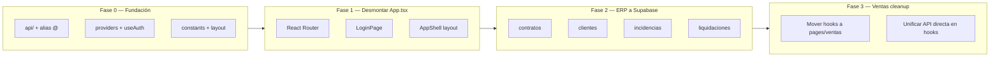

# ERP-ENERSAVE — Plan de refactor arquitectónico

> Objetivo: alinear la estructura con **Festiva** (componentes, hooks, api/servicios, pages) usando **Supabase** como backend único.

## Estado actual vs objetivo

| Aspecto | Hoy | Objetivo |
|---------|-----|----------|
| Routing | `App.tsx` + `activeModule` / `currentMenuTab` (~5.000 líneas) | React Router + pages delgadas |
| Datos ERP | Estado local + seeds en `App.tsx` | Supabase + hooks por dominio |
| Datos Ventas | Supabase + hooks en `lib/ventas/hooks/` | `api/ventas/` + `pages/ventas/hooks/` |
| Supabase | `lib/supabase/*` (13 módulos) | `api/supabase/` + servicios por dominio |
| Hooks globales | 1 (`use-editable-cell`) | Auth, permisos, navegación, etc. |
| Componentes | Mezcla panels en raíz + `ventas/` | `pages/*/components/` + `components/ui/` |

## Estructura objetivo

```
src/
├── api/                          # Capa de datos (Supabase)
│   ├── supabaseClient.ts         # Singleton cliente
│   ├── auth/
│   │   └── auth.service.ts       # Session, login, profile sync
│   ├── ventas/
│   │   ├── prospectos.service.ts
│   │   ├── tareas.service.ts
│   │   ├── actividades.service.ts
│   │   └── enersave-leads.service.ts
│   ├── erp/
│   │   ├── contracts.service.ts
│   │   ├── clientes.service.ts
│   │   ├── settlements.service.ts
│   │   ├── incidencias.service.ts
│   │   ├── marco-retributivo.service.ts
│   │   └── comerciales.service.ts
│   └── result.ts                 # Tipos compartidos ApiResult
│
├── components/
│   ├── ui/                       # Primitivos reutilizables (DateRangePicker, Skeletons…)
│   ├── layout/                   # Shell, Sidebar, Header (extraídos de App)
│   └── auth/                     # LoginForm, guards
│
├── constants/
│   ├── styles.ts                 # Clases Tailwind reutilizables
│   └── navigation.ts             # Tabs, rutas, labels de módulos
│
├── hooks/                        # Hooks globales
│   ├── useAuth.tsx               # AuthProvider + session
│   ├── useAppNavigation.ts       # Módulo/tab activo (transición a router)
│   └── use-editable-cell.tsx
│
├── lib/                          # Lógica pura (sin React, sin fetch)
│   ├── ventas/                   # pipeline, stage-gate, SLA, KPIs…
│   ├── contract-*                # Dominio contratos
│   ├── liquidaciones-*           # Cálculos liquidaciones
│   ├── pdf/                      # Generación PDF
│   └── utils.ts                  # cn(), helpers genéricos
│
├── pages/
│   ├── auth/
│   │   └── LoginPage.tsx
│   ├── erp/
│   │   ├── dashboard/
│   │   │   ├── DashboardPage.tsx
│   │   │   └── hooks/useDashboardPage.ts
│   │   ├── contratos/
│   │   │   ├── ContratosPage.tsx
│   │   │   ├── hooks/useContratosPage.ts
│   │   │   └── components/       # Filtros, tabla, modales
│   │   ├── clientes/
│   │   ├── liquidaciones/
│   │   ├── incidencias/
│   │   ├── marco-retributivo/
│   │   ├── productos/
│   │   ├── comparador/
│   │   ├── cashflow/
│   │   └── usuarios/
│   └── ventas/
│       ├── pipeline/
│       ├── mi-dia/
│       ├── ficha/
│       ├── reporting/
│       ├── sla-avisos/
│       └── enersave-leads/
│
├── providers/
│   └── AppProviders.tsx          # Theme, Auth, Toaster
│
├── types/                        # Tipos globales compartidos
├── data/                         # Catálogos estáticos
├── App.tsx                       # Shell delgado (~100 líneas)
└── main.tsx
```

## Patrón por capa (referencia Festiva)

### 1. Page (vista delgada)

```tsx
// pages/erp/contratos/ContratosPage.tsx
export function ContratosPage() {
  const vm = useContratosPage()
  return <ContratosTable {...vm} />
}
```

### 2. Hook (estado + efectos + handlers)

```tsx
// pages/erp/contratos/hooks/useContratosPage.ts
export function useContratosPage() {
  const { contracts, loading, refresh } = useContracts()
  const filters = useContratosFilters()
  const filtered = useMemo(() => applyFilters(contracts, filters), [...])
  return { filtered, loading, refresh, ...handlers }
}
```

### 3. Service (Supabase)

```tsx
// api/erp/contracts.service.ts
export const contractsService = {
  list: () => listContracts(),
  create: (input) => saveTeamContractToSupabase(input),
  update: (id, patch) => updateContract(id, patch),
}
```

### 4. Lib (lógica pura)

```tsx
// lib/contract-renewal.ts — sin imports de React ni Supabase
export function computeRenewalStatus(contract: Contract): RenewalStatus { ... }
```

## Dominios y prioridad de migración



| Fase | Alcance | Archivos críticos |
|------|---------|-------------------|
| **0** | Carpetas, alias `@/`, re-exports, `styles.ts` | `vite.config.ts`, `tsconfig.json` |
| **1** | Router + Auth + Layout | `App.tsx` → shell |
| **2** | ERP panels → pages + hooks + Supabase read | `ContratosPanel`, `MisClientesPanel`, `IncidenciasKanban` |
| **3** | Ventas: mover `lib/ventas/hooks` → `pages/ventas/*/hooks` | `MiDiaPage`, `FichaProspecto`, `MarcoRetributivoPanel` |
| **4** | Eliminar seeds / estado en App | `INITIAL_CRM`, `SEED_CONTRACTS` |
| **5** | Limpiar `app/` (Next.js huérfano) | `app/login`, `app/actions` |

## Anti-patrones detectados

1. **`App.tsx` monolito** — ~100 `useState`, routing manual, comparador inline, CRUD usuarios.
2. **Split-brain datos** — Ventas en Supabase; ERP en memoria con seeds.
3. **Lógica en vistas** — `ContratosPanel` (1.047 L), `NuevoContratoWizard` (952 L).
4. **API duplicada** — `listTareasByProspecto` directo en `MiDiaPage` / `FichaProspecto` pese a existir `useTareas`.
5. **Hooks inconsistentes** — ventas en `lib/ventas/hooks/`, resto sin hooks.
6. **Sin `@/` imports** — todo relativo; dificulta mover archivos.

## Referencia: Ventas (patrón a replicar)

Ventas es el módulo más avanzado:

```
components/ventas/PipelinePage.tsx
  → lib/ventas/hooks/useProspectos.ts
    → lib/supabase/ventas.ts
      → getSupabaseClient()
```

Tras refactor:

```
pages/ventas/pipeline/PipelinePage.tsx
  → pages/ventas/pipeline/hooks/usePipelinePage.ts
    → api/ventas/prospectos.service.ts
      → api/supabaseClient.ts
```

## Mapeo `lib/supabase/*` → `api/`

| Archivo actual | Servicio objetivo |
|----------------|-------------------|
| `client.ts` | `api/supabaseClient.ts` |
| `auth-session.ts` | `api/auth/auth.service.ts` |
| `ventas.ts` | `api/ventas/*.service.ts` (split por entidad) |
| `contracts.ts` | `api/erp/contracts.service.ts` |
| `clientes.ts` | `api/erp/clientes.service.ts` |
| `incidencias.ts` | `api/erp/incidencias.service.ts` |
| `settlements.ts` | `api/erp/settlements.service.ts` |
| `marco-retributivo.ts` | `api/erp/marco-retributivo.service.ts` |
| `erp-comerciales.ts` | `api/erp/comerciales.service.ts` |
| `enersave-leads.ts` | `api/ventas/enersave-leads.service.ts` |
| `result.ts` | `api/result.ts` |
| `service-role.ts` | `api/supabaseServiceRole.ts` (solo scripts/webhooks) |

## Reglas de migración

1. **Re-export temporal** — al mover un módulo, dejar re-export en la ruta antigua hasta actualizar todos los imports.
2. **Un dominio por PR** — no mezclar contratos + incidencias en el mismo commit.
3. **Tests antes de mover** — los 29 tests en `lib/ventas/` deben seguir pasando.
4. **Vista delgada** — si un `.tsx` supera ~200 líneas, extraer hook.
5. **Supabase solo en `api/`** — componentes y hooks nunca importan `getSupabaseClient` directamente.
6. **RLS** — toda query nueva debe respetar políticas existentes.

## Próximo paso inmediato

**Fase 0** (sin romper nada):

- [x] Documento de arquitectura (este archivo)
- [x] Alias `@/` → `src/`
- [x] `src/api/supabaseClient.ts` + re-exports
- [x] `src/constants/styles.ts` + `navigation.ts`
- [x] `src/lib/utils.ts` (`cn()`)
- [ ] `src/providers/AppProviders.tsx` — parcial (Theme + Router + Toaster)

**Fase 1** (primer corte real):

- [x] Instalar `react-router-dom`
- [x] Extraer `LoginPage` + `useAuth` (`AuthProvider`)
- [ ] Extraer `AppShell` (sidebar + header) — pendiente; sidebar sigue en `ErpWorkspace`
- [x] Reducir `App.tsx` a providers + `<RouterProvider />` (~5 líneas)
- [x] Mover lógica ERP a `pages/erp/ErpWorkspace.tsx` (lazy-loaded)
- [x] Rutas URL: `/login`, `/erp/*`, `/ventas/*` sincronizadas con tabs
